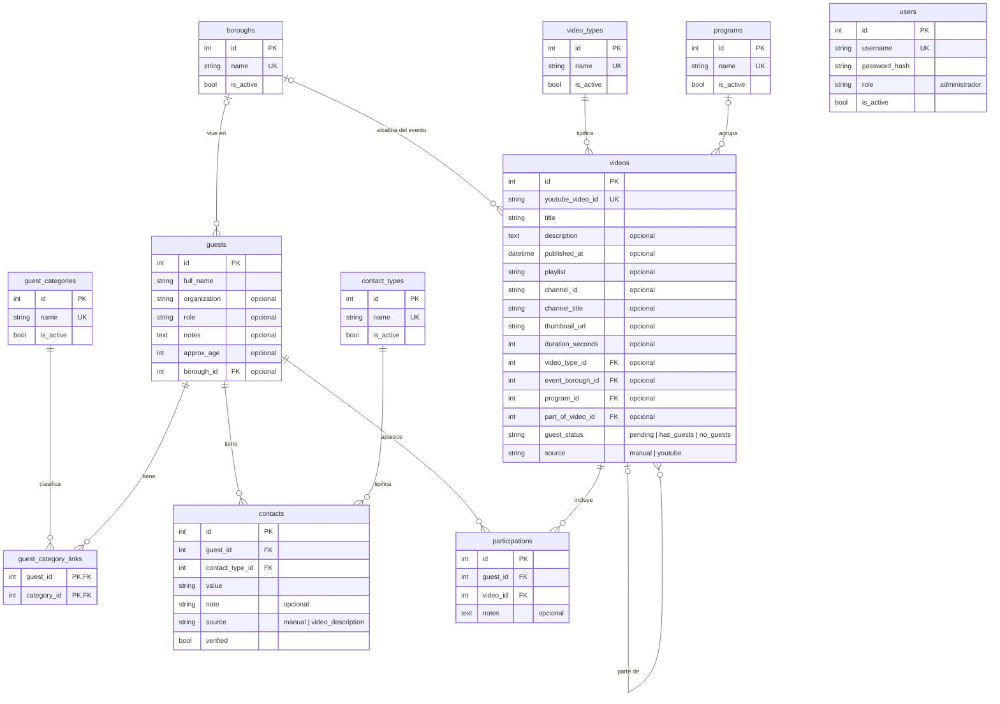

# Modelo de datos — X Live Medios

Deriva de la sección 5 de `PROJECT_BRIEF.md`. Tablas y columnas en inglés.
No existe `Season` (no hay temporadas). Las tablas de staging de IA (Fase 3) no se
incluyen aquí. `users` (Fase 2) se agrega abajo, sin relaciones con el resto.

## Diagrama ER

## Reglas por tabla

### Catálogos
`guest_categories`, `video_types`, `contact_types`, `boroughs` y `programs` comparten forma:
`id`, `name` único, `is_active` (desactivar en lugar de borrar, para no romper referencias).
Se administran desde la app (agregar, renombrar, desactivar). Fusionar categorías (FR-004) sigue pendiente.
La unicidad del nombre se valida en la aplicación ignorando mayúsculas, acentos y espacios extra;
la restricción `UNIQUE` de la BD solo cubre el nombre exacto.
- Solo `boroughs` se precarga (16 alcaldías de CDMX). Los demás empiezan vacíos: no se inventan datos.
- `guest_categories` = tipo de talento del invitado.

### guests
- Un registro por persona; no se duplica por aparecer en varios videos.
- Solo `full_name` es obligatorio. Edad, alcaldía, organización, rol y notas son opcionales.
- `approx_age` guarda edad aproximada (búsqueda por rangos), `CHECK approx_age >= 0`.
- `borough_id` = alcaldía donde vive el invitado (opcional).

### guest_category_links
Relación N↔N Guest–GuestCategory. Clave primaria compuesta (`guest_id`, `category_id`), por lo que no se repite la misma categoría. Un invitado puede tener cero categorías.

### contacts
- Un invitado tiene 0..N contactos. Tipo por catálogo (`contact_types`), sin campos vacíos por tipo.
- `source`: `manual` o `video_description`. `verified` indica validación humana.
- El patrocinador es un contacto de tipo "patrocinador" con valor y `note` (ej. nombre de la empresa).
- Nunca se inventan valores.

### videos
- `youtube_video_id` único: evita ingesta duplicada. Los metadatos de YouTube viven en columnas propias del video, separados de las entidades de dominio (invitados, participaciones).
- `video_type_id`, `program_id`, `event_borough_id`, `part_of_video_id`: todos opcionales.
- `part_of_video_id` autorreferencia ("parte 2 de otro video"), `CHECK part_of_video_id <> id`.
- `guest_status`: `pending` (aún sin revisar), `has_guests`, `no_guests` (propuesta de la IA, reclasificable por un humano; FR-014).
- `source`: `manual` (cargado desde la app, migración `0004`) o `youtube` (lo trae la ingesta de la Fase 3). Permite localizar y borrar los videos de prueba cuando lleguen los reales. Los videos existentes al migrar quedan como `manual`.

### users
Usuarios de la app (migración `0003`). `username` único, contraseña solo como hash (argon2), `role` en texto
(hoy solo `administrador`) e `is_active`. Sin relación con las demás tablas: aún no se registra quién hizo cada cambio.

### participations
- Aparición de un invitado en un video (N↔N). `UNIQUE (guest_id, video_id)`.
- Un video puede tener cero participaciones. No se crean participaciones vacías para videos sin invitados.

## Decisiones a confirmar
1. `guest_status` en `videos`: es un campo mínimo para FR-014. ¿Se prefiere dejarlo para la Fase 3 junto con staging? Recomiendo incluirlo ahora para no migrar después.
2. `playlist` como texto simple en `videos`. Si luego se necesita jerarquía de playlists, se convierte en tabla.
3. `ON DELETE`: catálogos → `RESTRICT` (se desactivan, no se borran con uso); `contacts`, `guest_category_links` y `participations` → `CASCADE` al borrar el invitado o el video.

## Preguntas abiertas (no asumidas)
Lista de programas, datos del patrocinador, historial de cambios, plazo de "sin contactar".
